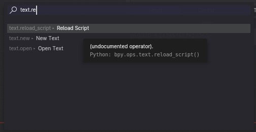

# Blender-execute-script
Actualiza en memoria y ejecuta los scripts almacenados en DATA 

## Blender version
- 4.0.0

## Instalación
- Instalar como cualquier otro addon

## Uso
1. Abrir el script en el editor de texto bien mediante "Open Text" o "Edit Source" del menú contextual
2. Activar el buscador flotante con F3 y escribir "text.reload_script"

> Nota 1: Puede ejecutarse en cualquier parte de blender

> Nota 2: El uso de este complemento está pensado para usar junto con la edición de editores externos

> Nota 3: Para cada script editado es necesario abrirlo siguiendo el paso 1

> Nota 4: Usar con precaución, el complemento está excento de pruebas rigurosas
